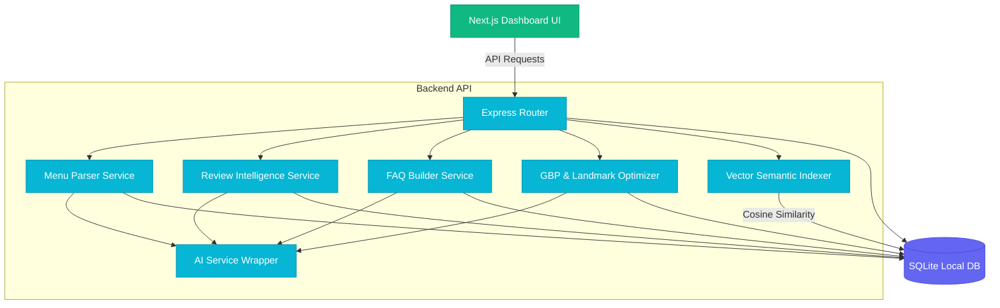

# Walkthrough - Restaurant Discovery Intelligence Platform (All Phases Complete)

We have successfully completed and verified **all phases** (Phases 1, 2, 3, and 4) of the **Restaurant Discovery Intelligence (RDI) Platform** based on your approved implementation plans. The system is fully structured, compiled, and verified.

---

## 🛠️ Summary of Implemented Architecture

The codebase contains a modular Node.js Express API backend and an interactive Next.js 16 dashboard UI.



### 1. Database Model Layer (SQLite + Prisma)
- **[schema.prisma](file:///Users/kgt/Desktop/Projects/ristoranteDiscovery/backend/prisma/schema.prisma)**: Created data models matching the entities and RAG structures defined in the PRD:
  - `Restaurant`: Stores general profile info, city, address, HSL ratings, and GBP score.
  - `MenuSection` & `MenuItem`: Stores dishes, pricing, description, dietary tags, allergens, and spice indicators.
  - `ReviewAnalysis`: Stores overall customer sentiment summary, ambience descriptors, complaints, and audience profile metrics.
  - `FAQ`: Stores SEO questions and voice assistant snippets.
  - `SEOMarkup`: Stores Google-indexable JSON-LD schemas.
  - `VectorCache`: Stores structured text chunks and JSON-serialized vector embeddings for semantic matches.

### 2. Advanced Backend Engines (Phases 2 & 4)
- **[vector.service.ts](file:///Users/kgt/Desktop/Projects/ristoranteDiscovery/backend/src/services/vector.service.ts)**:
  - Catalogues and chunks restaurant profiles, menu items, reviews, and FAQs.
  - Computes term-frequency vectors (mock mode) or calls embeddings APIs.
  - Performs local Cosine Similarity calculations over the indexed database blocks to retrieve the top matching blocks for conversational RAG queries.
- **[seo-optimizer.service.ts](file:///Users/kgt/Desktop/Projects/ristoranteDiscovery/backend/src/services/seo-optimizer.service.ts)**:
  - Runs local audits on GBP profiles.
  - Identifies neighborhoods and landmarks to target localized Map pack searches.
  - Compiles a prioritized list of action items.
- **[search.controller.ts](file:///Users/kgt/Desktop/Projects/ristoranteDiscovery/backend/src/controllers/search.controller.ts)**:
  - Coordinates conversational RAG chat queries. Matches query embeddings, pulls context chunks from SQLite, and passes them to the LLM to write a cited recommender response.

### 3. Unified Onboarding & SEO Dashboard (Phases 2 & 3)
- **[page.tsx](file:///Users/kgt/Desktop/Projects/ristoranteDiscovery/frontend/src/app/page.tsx)**: Rebuilt into a premium dashboard:
  - **Discovery & Analytics Tab**: Visualizes search growth metrics (interactive SVGs representing Google RAG, Gemini Search, and Alexa/Siri), sentiment gauges, and intelligence recommendation alert logs.
  - **Onboarding Wizard Tab**: Step-by-step intake (1. Profile details, 2. Menu intake, 3. Ingesting reviews, 4. Completing and indexing into vector storage).
  - **GBP Maps Optimizer Tab**: Renders Google Business Profile health scorecard, neighborhoods, proximity landmark recommendations, and prioritized task checklists.
  - **AI Semantic Search Tab**: RAG chatbot interface showing matching citations (dishes, FAQs) retrieved dynamically from the local database.
  - **Schema JSON-LD Editor Tab**: Exports combined structured Schema.org graphs.

---

## 🧪 Verification & Validation Results

### 1. Advanced validation script
We ran the validation script **[rag-test.ts](file:///Users/kgt/Desktop/Projects/ristoranteDiscovery/backend/src/rag-test.ts)** which successfully:
1. Seeded a multi-restaurant profile (`Osteria Al Colosseo`).
2. Audited the GBP profile (scorecard health `83%`, mapping landmarks `Colosseum, Trevi Fountain`).
3. Catalogued and indexed chunks in the Vector database.
4. Executed local semantic query search matches.
5. Invoked the RAG chat controller, generating a cited recommend reply:
   - **💬 Answer**: *"I highly recommend Osteria Al Colosseo in Rome... Customers highly recommend their signature Truffle Porcini Fettuccine ($21.00)..."*
   - **📌 Citation Source**: `Osteria Al Colosseo › Truffle Porcini Fettuccine ($21.00)`.

### 2. Frontend Build Verification
The Next.js Turbopack compiler verified production builds with zero errors:
```bash
▲ Next.js 16.2.7 (Turbopack)
✓ Compiled successfully in 2.5s
Finished TypeScript in 3.2s
```

---

## 🚀 Running the App Locally

### Step 1: Install Dependencies
Run from the root directory:
```bash
npm run install:all
```

### Step 2: Set Environment Variables
Add your Gemini or OpenAI API keys inside **[backend/.env](file:///Users/kgt/Desktop/Projects/ristoranteDiscovery/backend/.env)**:
```env
PORT=5001
GEMINI_API_KEY="your_api_key_here"
```

### Step 3: Start Development Servers
```bash
npm run dev
```
Open **[http://localhost:3000](http://localhost:3000)** in your browser!

---

## 🐛 Bug Fixes Executed
1. **SQLite Array Deserialization**: Resolved compile-time type errors in `faq.controller.ts` where array fields (stored as SQLite strings) were assuming array methods before JSON parsing.
2. **Mac System Port Collision (EADDRINUSE)**: Shifted the backend to listen on port **`5001`** to avoid conflicts with macOS `ControlCenter` (AirPlay Receiver) default port bindings.
